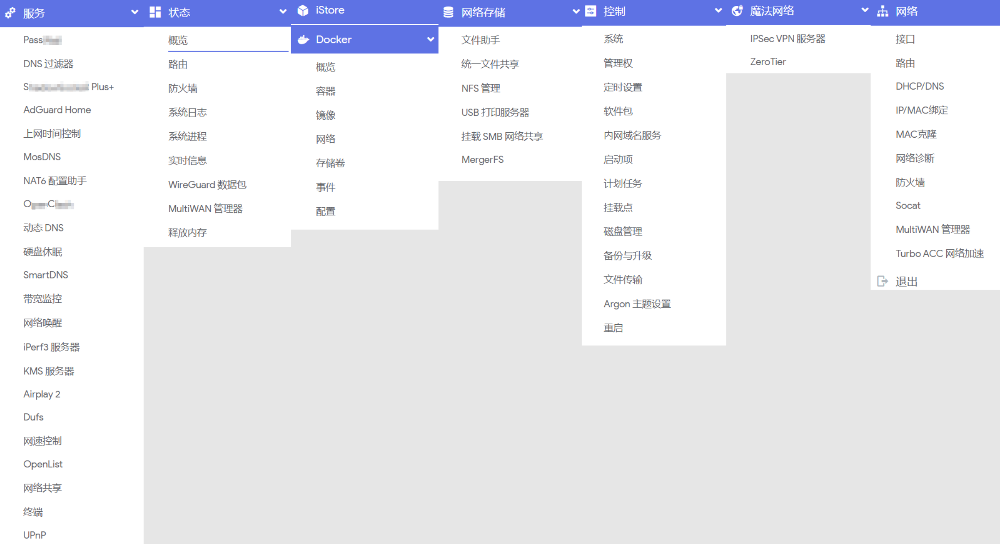

## AE86Wrt 🎉🎉🎉

```
固件管理ip：192.168.2.1  
用户名：root
密码： 无密码(或password)
```

#### 固件下载

* 认准自己设备型号，本项目Releases即可 **[下载](https://github.com/xiangfeidexiaohuo/AE86Wrt/releases)** 对应固件。

* 基于[Lede](https://github.com/coolsnowwolf/lede)源码，支持：
```
X86_64（efi固件）
Rockchip（R2S/R2C、R3S、R4S、R5S/R5C、R6S/R6C、H28K/H29K、H66K/H68K/H69K、电犀牛R66S/R68S、M5、R76S等）
小米IPQ807x（AX3600、AX9000、红米AX6）、红米AX6S、斐讯K3 
```
* 其中X86-R24.10/R25.12基于[OpenWrt官方](https://github.com/openwrt/openwrt)源码，R24.10稳定，带iStore套件；R25.12为最新，仅供体验！

* 基于[hanwckf-mt798x](https://github.com/hanwckf/immortalwrt-mt798x)源码的MT798x系列，闭源无线驱动，信号稳定；[相关uboot](https://github.com/hanwckf/bl-mt798x/releases)。
```
360-T7、小米AX3000T-MTK、H3C-NX30Pro、小米WR30U、红米AX6000、Netcore-N60等
```
* 固件附带常规实用插件，因设备硬件配置、性能、是否带USB等不一样，所带插件有些微差异。



