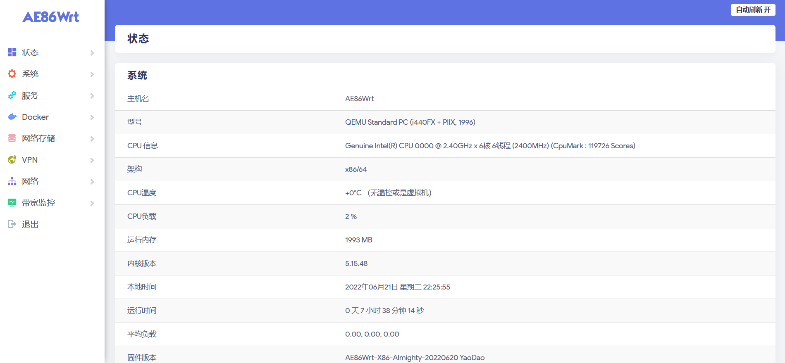
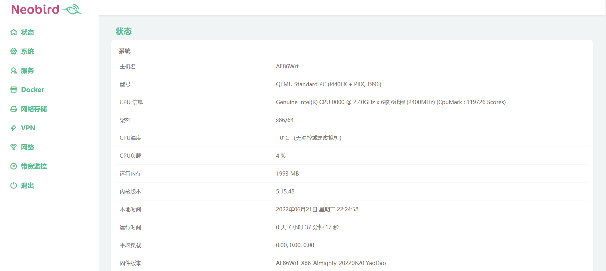
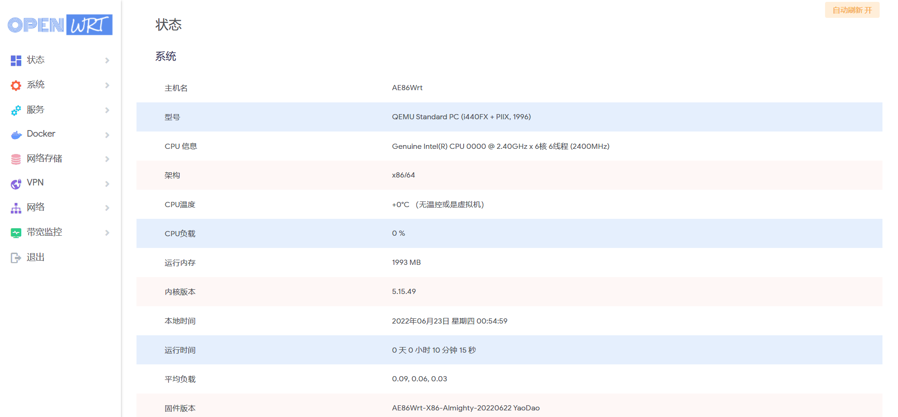
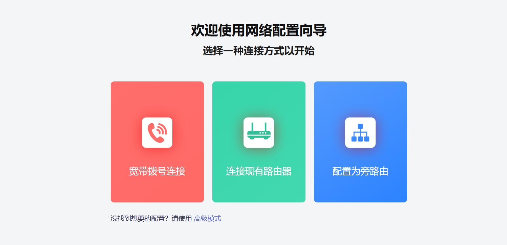

#### LEDE-Lean

* 基于[Lean源码](https://github.com/coolsnowwolf/lede)编译的固件：

* [OpenWrt-X86_64-全能极速](https://www.right.com.cn/forum/thread-4054849-1-1.html) 

* [OpenWrt+R2203-X86_64-精简版多内核](https://www.right.com.cn/forum/forum.php?mod=viewthread&tid=7182055&page=1&extra=)

* [斐讯K3-OpenWrt](https://www.right.com.cn/forum/thread-4052645-1-1.html)

* [红米AX6 OpenWrt-5.10.x](https://www.right.com.cn/forum/forum.php?mod=viewthread&tid=6770103&page=1&extra=#pid14665099) [停更]

* [小米AX3600 OpenWrt-5.10.x](https://www.right.com.cn/forum/forum.php?mod=viewthread&tid=7310044&page=1&extra=#pid15314306) [停更]

* [小米AX6/AX3600 OpenWrt-5.15.x](https://www.right.com.cn/forum/thread-8218915-1-1.html)

* [R2S OpenWrt-5.15.x](https://www.right.com.cn/forum/thread-8239527-1-1.html)

***

* 不出意外，固件每周五上午更新！

* x86-全能版各种插件都内置了，不带istore

* x86-R2203固件带QuickStart便捷首页和iStore

* AX6/AX3600/x86-Lite版/R2S仅带iStore

***

#### X86全能版截图预览：

***

#### 更多主题预览：

* 主题下载(仅适用于Lean的LEDE源码的固件，不适用于openwrt-r2102、r2203）：

[edge](https://raw.githubusercontent.com/xiangfeidexiaohuo/OpenWrt_Build/master/theme/luci-theme-edge_2.5-20210107_all.ipk) 、[ifit](https://raw.githubusercontent.com/xiangfeidexiaohuo/OpenWrt_Build/master/theme/luci-theme-ifit_1.6-1_all.ipk) 、[neobird](https://raw.githubusercontent.com/xiangfeidexiaohuo/OpenWrt_Build/master/theme/luci-theme-neobird_2.1-20220621_all.ipk) 、[opentopd](https://raw.githubusercontent.com/xiangfeidexiaohuo/OpenWrt_Build/master/theme/luci-theme-opentopd_1.4.9-20220220_all.ipk) 、[argon](https://raw.githubusercontent.com/xiangfeidexiaohuo/OpenWrt_Build/master/theme/luci-theme-argon-18.06_1.7.3-20220421_all.ipk)

* neobird:

* opentopd:

* edge:

* ifit:

***

#### QuickStart便捷首页截图欣赏：

#### iStore截图欣赏：

***

* [个人自用插件库](https://github.com/xiangfeidexiaohuo/openwrt-packages)

