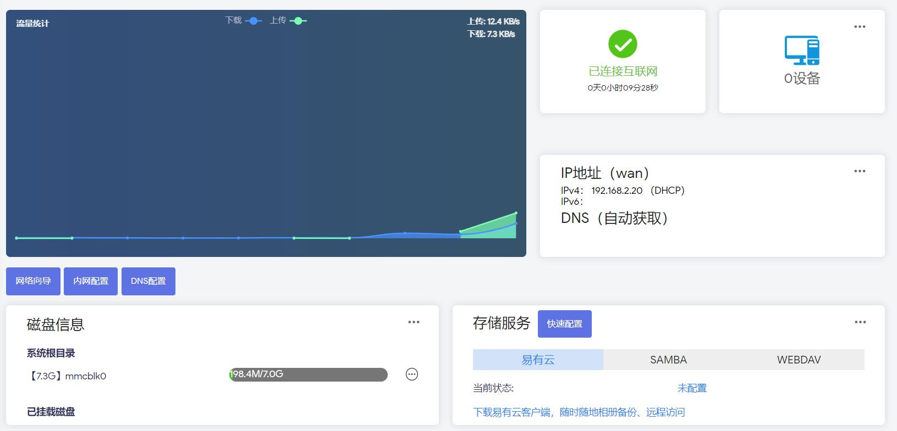
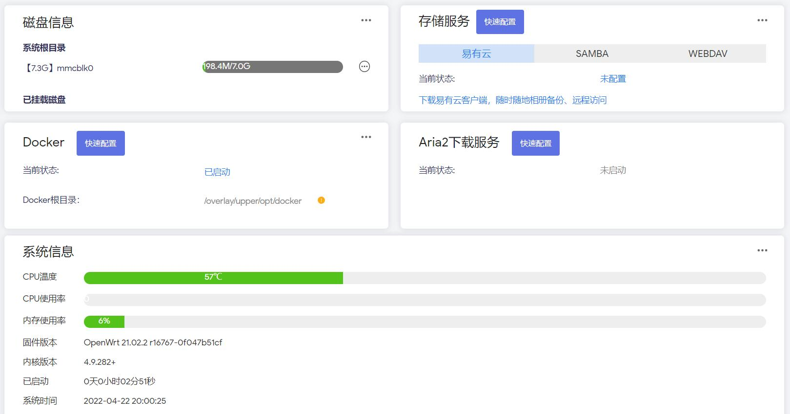

#### LEDE-Lean

* 基于[Lean源码](https://github.com/coolsnowwolf/lede)编译的固件：

* [OpenWrt-X86_64-全能极速](https://www.right.com.cn/forum/thread-4054849-1-1.html) [正常周更]

* [OpenWrt+R2203-X86_64-精简版多内核](https://www.right.com.cn/forum/forum.php?mod=viewthread&tid=7182055&page=1&extra=) [正常周更]

* [斐讯K3-OpenWrt](https://www.right.com.cn/forum/thread-4052645-1-1.html) [正常月更]

* [红米AX6 OpenWrt-5.10.x](https://www.right.com.cn/forum/forum.php?mod=viewthread&tid=6770103&page=1&extra=#pid14665099) [停更]

* [小米AX3600 OpenWrt-5.10.x](https://www.right.com.cn/forum/forum.php?mod=viewthread&tid=7310044&page=1&extra=#pid15314306) [停更]

* [小米AX6/AX3600 OpenWrt-5.15.x](https://www.right.com.cn/forum/thread-8218915-1-1.html) [正常周更]

***

* x86-全能版各种插件都内置了，不带istore

* x86-R2203固件带QuickStart便捷首页和iStore

* AX6/AX3600/x86-Lite版仅带iStore

***

* QuickStart便捷首页截图欣赏：

* iStore截图欣赏：

***

* [个人自用插件库](https://github.com/xiangfeidexiaohuo/openwrt-packages)

