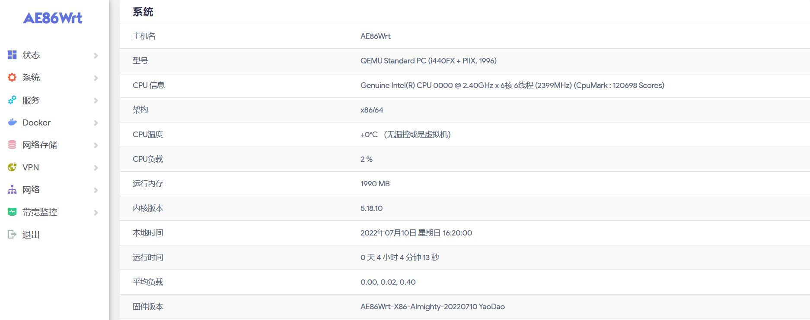
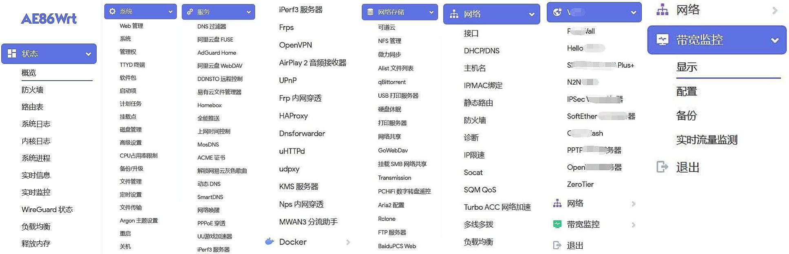
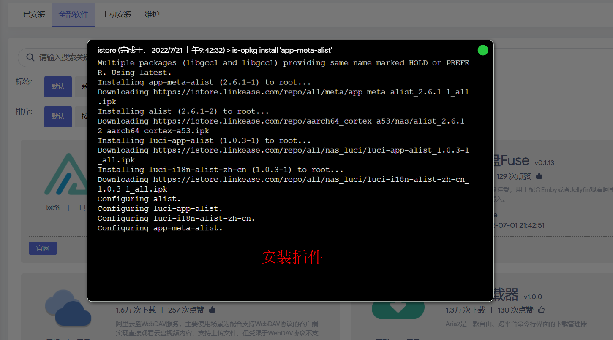

#### OpenWrt 自娱自乐

<details>
<summary>点击展开，查看固件详情！</summary>

* 基于[Lean源码](https://github.com/coolsnowwolf/lede)编译的固件：

* [OpenWrt-X86_64-全能版5.15/5.18/5.19内核](https://www.right.com.cn/forum/thread-4054849-1-1.html) 

* [OpenWrt-X86_64-精简版五种内核](https://www.right.com.cn/forum/forum.php?mod=viewthread&tid=7182055&page=1&extra=)

* [斐讯K3-OpenWrt](https://www.right.com.cn/forum/thread-4052645-1-1.html)

* [红米AX6 OpenWrt-5.10内核](https://www.right.com.cn/forum/forum.php?mod=viewthread&tid=6770103&page=1&extra=#pid14665099) [停更]

* [小米AX3600 OpenWrt-5.10内核](https://www.right.com.cn/forum/forum.php?mod=viewthread&tid=7310044&page=1&extra=#pid15314306) [停更]

* [小米AX6/AX3600 OpenWrt-5.15内核](https://www.right.com.cn/forum/thread-8218915-1-1.html)

* [R2S/R4S OpenWrt-5.19内核](https://www.right.com.cn/forum/thread-8239527-1-1.html)

***

* 基于[官方OpenWrt-r22.03](https://github.com/openwrt/openwrt/tree/openwrt-22.03)编译的固件：

* [OpenWrt-R2203-X86_64-精简版](https://www.right.com.cn/forum/forum.php?mod=viewthread&tid=7182055&page=1&extra=)


</details>

***

* 不出意外，固件每周五上午更新！[此处寻找自己的设备下载固件](https://github.com/xiangfeidexiaohuo/OpenWrt_Build/releases)

```
固件管理ip：192.168.2.1  
用户名：root
密码：password (后期固件默认无密码)
```
* X86_64全能版自带超全插件，各种调试工具，各种FQ插件、Docker、下载工具等

* X86_64精简版带iStore插件商店，和一些常规插件，尽量轻量化，无Dcoker

* R2S/R4s带iStore插件商店，和一些常规插件，尽量轻量化，带Dcoker

* AX6/AX3600带iStore插件商店，和少量常规插件，轻量化，固件控制在29M以内

* X86_64-R2203精简版带iStore插件商店，和一些常规插件，尽量轻量化，带QuickStart便捷首页，带Docker

***

#### X86全能版截图预览：






***

#### 更多主题预览：

* 主题下载(仅适用于Lean的LEDE源码的固件，不适用于openwrt-r2102、r2203）：

* [点击下载，解压后手动安装，链接密码:lede](https://eto.lanzouw.com/b0exvb20h) 

<details>
<summary>点击展开预览！</summary>

* neobird:


* opentopd:


* edge:


* ifit:


</details>

***

#### QuickStart便捷首页截图欣赏：

<details>
<summary>点击展开预览！</summary>


</details>

#### iStore插件商店截图欣赏：

<details>
<summary>点击展开预览！</summary>





</details>

***

* [个人自用插件库](https://github.com/xiangfeidexiaohuo/openwrt-packages)


