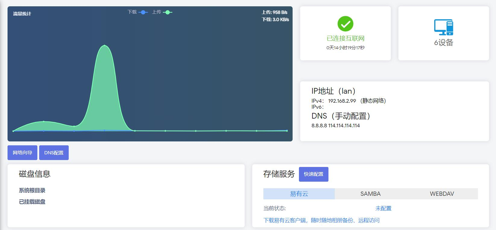
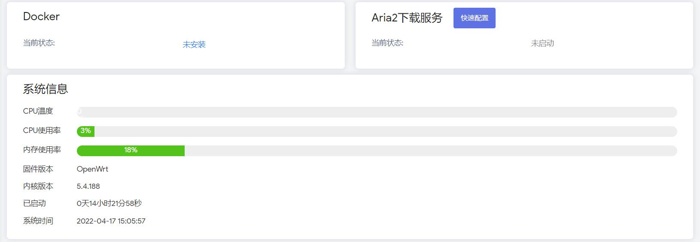

#### LEDE-Lean

* 基于[Lean源码](https://github.com/coolsnowwolf/lede)编译的固件：

[OpenWrt-X86_64-全能极速](https://www.right.com.cn/forum/thread-4054849-1-1.html)

[OpenWrt+R2203-X86_64-精简版多内核](https://www.right.com.cn/forum/forum.php?mod=viewthread&tid=7182055&page=1&extra=)

[斐讯K3-OpenWrt](https://www.right.com.cn/forum/thread-4052645-1-1.html)

[红米AX6 OpenWrt-5.10.x](https://www.right.com.cn/forum/forum.php?mod=viewthread&tid=6770103&page=1&extra=#pid14665099)

[小米AX3600 OpenWrt-5.10.x](https://www.right.com.cn/forum/forum.php?mod=viewthread&tid=7310044&page=1&extra=#pid15314306)

* R2203-X86_64固件带QuickStart便捷首页和iStore

* 红米AX6/小米AX3600固件带iStore

* QuickStart便捷首页截图欣赏：

* iStore截图欣赏：

* [个人自用插件库](https://github.com/xiangfeidexiaohuo/openwrt-packages)

