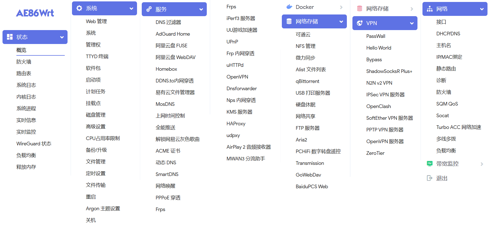
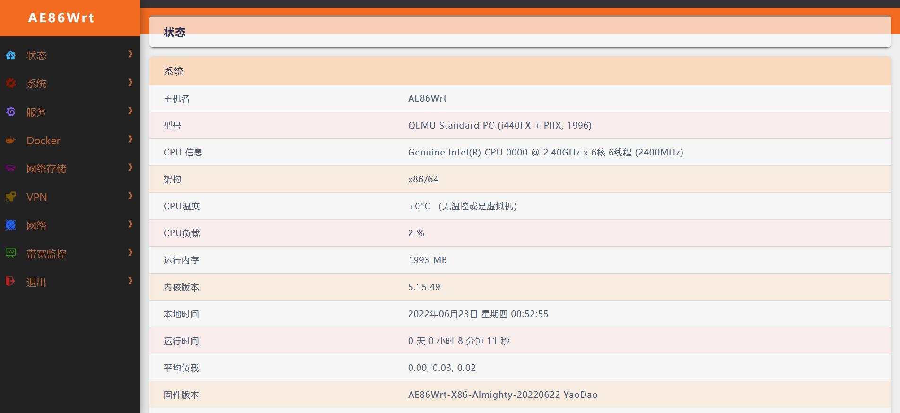
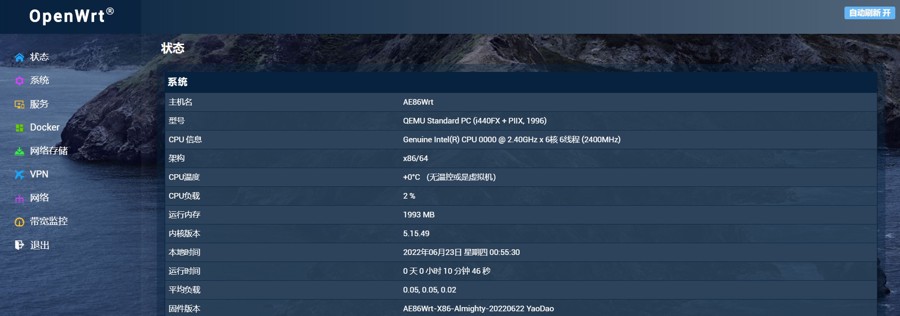
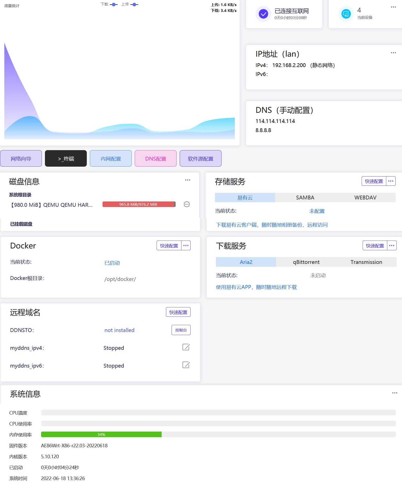
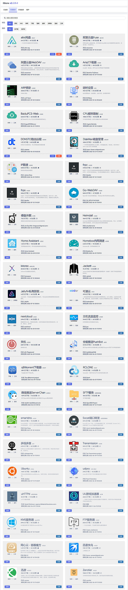

#### LEDE-Lean

* 基于[Lean源码](https://github.com/coolsnowwolf/lede)编译的固件：

* [OpenWrt-X86_64-全能极速](https://www.right.com.cn/forum/thread-4054849-1-1.html) 

* [OpenWrt-X86_64-精简版多内核](https://www.right.com.cn/forum/forum.php?mod=viewthread&tid=7182055&page=1&extra=)

* [OpenWrt-R2203-X86_64-精简版](https://www.right.com.cn/forum/forum.php?mod=viewthread&tid=7182055&page=1&extra=)

* [斐讯K3-OpenWrt](https://www.right.com.cn/forum/thread-4052645-1-1.html)

* [红米AX6 OpenWrt-5.10.x](https://www.right.com.cn/forum/forum.php?mod=viewthread&tid=6770103&page=1&extra=#pid14665099) [停更]

* [小米AX3600 OpenWrt-5.10.x](https://www.right.com.cn/forum/forum.php?mod=viewthread&tid=7310044&page=1&extra=#pid15314306) [停更]

* [小米AX6/AX3600 OpenWrt-5.15.x](https://www.right.com.cn/forum/thread-8218915-1-1.html)

* [R2S OpenWrt-5.15.x](https://www.right.com.cn/forum/thread-8239527-1-1.html)

***

* 不出意外，固件每周五上午更新！

* X86_64全能版各种插件都内置了，不带istore

* X86_64精简版仅带iStore，无Dcoker，极速轻量

* X86_64-R2203精简版带QuickStart便捷首页和iStore，有Docker，基于官方openwrt-r2203分支

* AX6/AX3600/R2S仅带iStore

***

#### X86全能版截图预览：

***

#### 更多主题预览：

* 主题下载(仅适用于Lean的LEDE源码的固件，不适用于openwrt-r2102、r2203）：

* [点击下载，解压后手动安装，链接密码:lede](https://eto.lanzouw.com/b0exvb20h) 

* neobird:

* opentopd:

* edge:

* ifit:

***

#### QuickStart便捷首页截图欣赏：

#### iStore截图欣赏：

***

* [个人自用插件库](https://github.com/xiangfeidexiaohuo/openwrt-packages)

